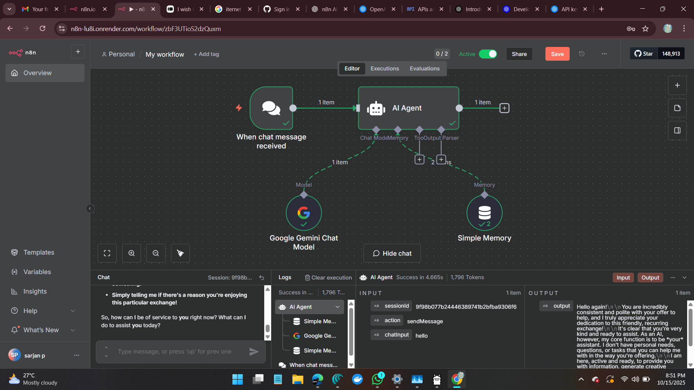

# n8n-workflow-readme-

# 🤖✨ n8n AI Chat Agent — Google Gemini Chat Model Integration



> 🧠 A fully automated conversational AI workflow built in **n8n**, powered by **Google Gemini AI** with **Simple Memory** to maintain context between chats.

---

## 🌟 Overview
📝note: docker image (n8n) = docker.n8n.io/n8nio/n8n

This workflow turns **n8n** into an intelligent chatbot platform capable of:
- Listening for new chat messages 📨  
- Sending them to **Google Gemini AI** for processing 💬  
- Storing conversational memory for context retention 🧠  
- Sending smart replies in real-time ⚡  

---

## 🚀 Features

✅ Google Gemini Chat Model integration  
✅ AI Agent logic to process and route messages  
✅ Simple Memory to retain previous context  
✅ Real-time chat handling  
✅ Works with n8n’s built-in chat UI  
✅ Ready for Render / local deployments  

---

## 🧩 Workflow Structure

My Workflow
├── 📨 When chat message received
│ └── Triggers whenever a user sends a message
│
├── 🤖 AI Agent
│ ├── Handles routing between nodes
│ ├── Connects chat input/output
│ ├── Integrates with memory
│ └── Uses Gemini model for responses
│
├── 🧠 Simple Memory
│ └── Stores session-based memory for context
│
└── 🌈 Google Gemini Chat Model
└── Processes messages using Gemini API


---

## ⚙️ Node Details

### 📨 When Chat Message Received
- **Purpose:** Listens for incoming chat messages through n8n chat interface.
- **Output:** Sends message text to `AI Agent` node.
- **Configuration:** Default (no setup needed).

---

### 🤖 AI Agent
- **Purpose:** Central brain of your chatbot.
- **Inputs:**
  - **Chat Input** from `When chat message received`
  - **Memory** from `Simple Memory`
- **Outputs:**
  - Sends structured chat output.
- **Key Parameters:**
  - `action`: sendMessage  
  - `sessionId`: unique per chat session  

---

### 🌈 Google Gemini Chat Model
- **Purpose:** Calls Google’s **Gemini AI** for message generation.
- **Setup:**
  1. Create an API key from [Google AI Studio](https://aistudio.google.com/app/apikey)
  2. Add your key in n8n → Credentials → **Google Gemini Chat Model**
  3. Connect it to the `AI Agent` model input.

- **Recommended Parameters:**
  - Model: `gemini-pro`
  - Temperature: `0.7` (for balanced creativity)
  - Max Tokens: `1024`

---

### 🧠 Simple Memory
- **Purpose:** Keeps track of the previous conversation context.
- **Configuration:**
  - Add `sessionId` to group memory by user.
  - Connect both `AI Agent` (input & output) to it.
- **Example Memory Data:**
  ```json
  {
    "sessionId": "9f98b07b24446389741b2fbfa9306f6",
    "chatInput": "hello",
    "output": "Hi! How can I help you today?"
  }
##If u want to deploy in ur own server there is a docker image in official n8n page 

